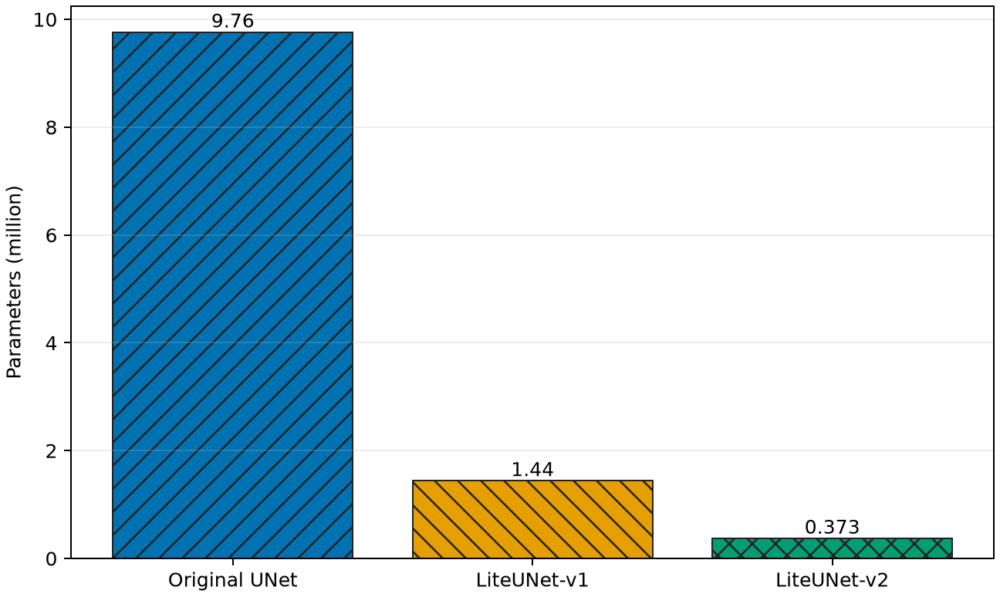
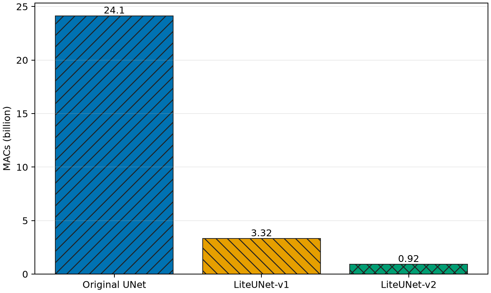
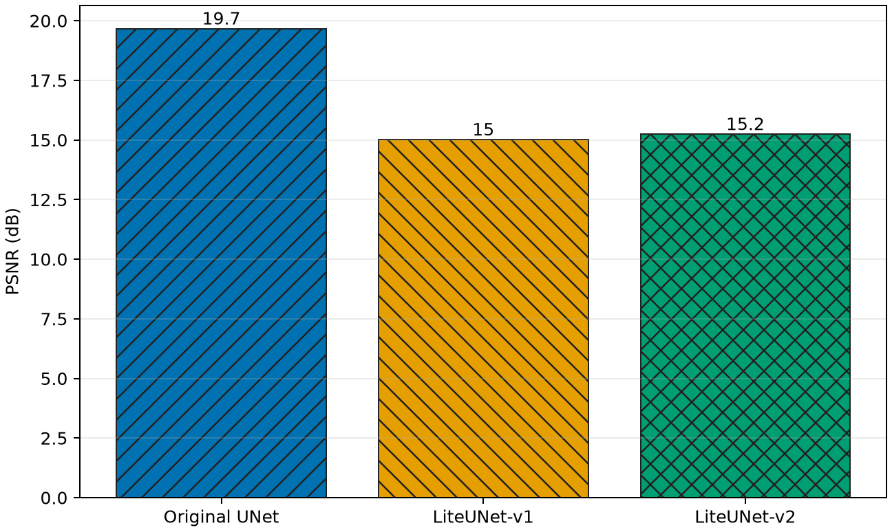
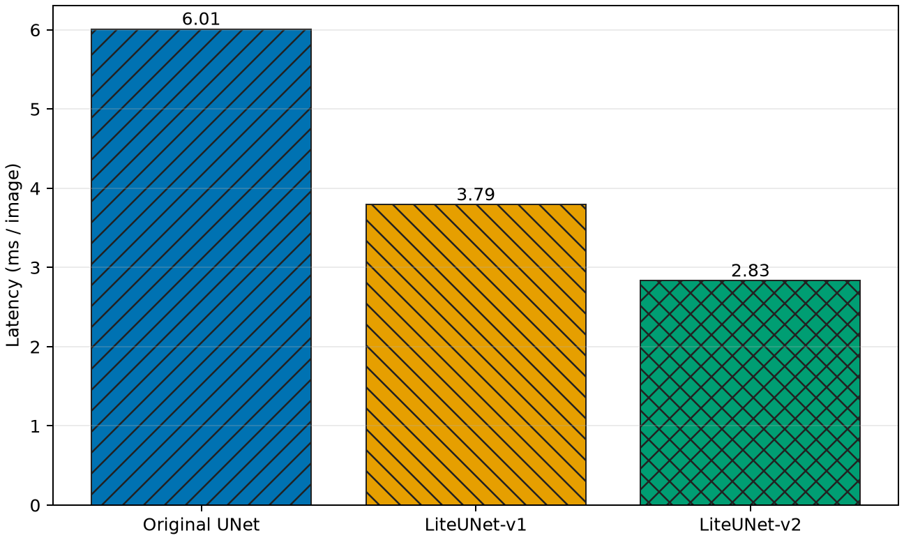
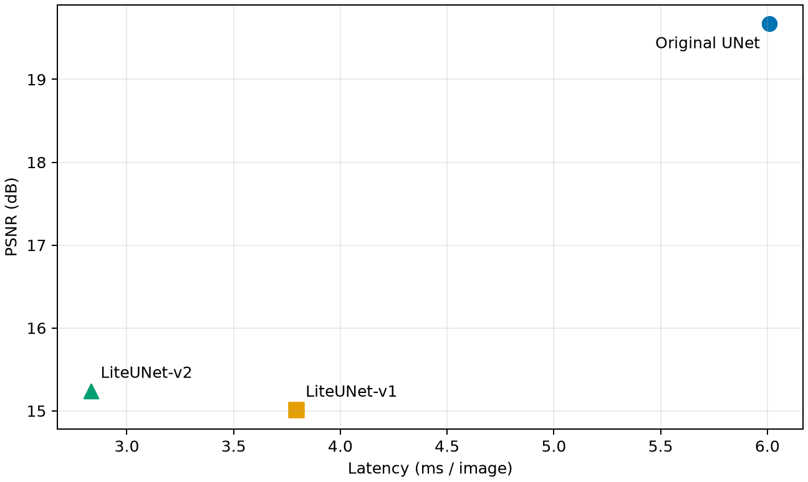

# EdgeRAW-LiteUNet

轻量级 4-channel RAW 图像去噪 UNet：在同一套 AISP 训练接口中，对 Original UNet、Depthwise Separable Conv 和通道压缩进行可复现消融。


- **任务**：RAW denoising，`4-channel RAW → 4-channel RAW`
- **模型**：Original UNet / LiteUNet-v1 / LiteUNet-v2
- **输出**：模型代码、统一配置、profiling、benchmark、CSV 和可再生成图表
- **上游项目**：[HuiiJi/AISP](https://github.com/HuiiJi/AISP)；原始说明见 [docs/UPSTREAM_README.md](docs/UPSTREAM_README.md)

## Architecture Roadmap

```text
Original UNet                         32 → 64 → 128 → 256 → 512
      │ replace suitable 3×3 Conv with DW 3×3 + PW 1×1
      ▼
LiteUNet-v1                          32 → 64 → 128 → 256 → 512
      │ halve the main channel widths
      ▼
LiteUNet-v2                          16 → 32 → 64 → 128 → 256
```

所有版本保持相同的 encoder-decoder 层级、skip connection、残差 RAW 输出和输入输出通道。

## Headline Results

| Model | Params | MACs | Latency ↓ | FPS ↑ |
| --- | ---: | ---: | ---: | ---: |
| Original UNet | 9.763 M | 24.143 G | 6.010 ms | 166.4 |
| LiteUNet-v1 | 1.442 M | 3.323 G | 3.793 ms | 263.6 |
| **LiteUNet-v2** | **0.373 M** | **0.920 G** | **2.833 ms** | **352.9** |

> Profiling/latency protocol: PyTorch FP32, batch=1, `1×4×256×256`, NVIDIA GeForce RTX 5070 Ti Laptop GPU, 10 warm-up + 50 timed iterations。MAC 表示 multiply-accumulate；FLOPs 按 `2 × MACs` 统计。

| Parameters | MACs |
| --- | --- |
|  |  |

**核心结论：** LiteUNet-v1 在不缩减通道的情况下将参数量和 MACs 分别降低 85.2% 和 86.2%；LiteUNet-v2 进一步达到 96.2% 的参数量/MACs 降幅。本机 FP32 测试中，v2 的 latency 相对 Original UNet 降低 52.9%，FPS 提升至约 2.12 倍。

## Project Background

RAW 域去噪直接处理 Bayer 数据打包后的四个通道，避免过早进入 RGB/ISP 流程。上游 AISP 项目提供了 IMX766 数据准备、训练、验证和推理框架；本项目在其上聚焦一个明确问题：**经典 UNet 可以在保留 RAW I/O 与拓扑的情况下轻量化到什么程度？**

本项目保留上游 `model_zoo/Unet.py` 作为对照组，只修改新增模型与统一接入层。上游完整项目说明、数据制作方法与推理流程已归档到 [docs/UPSTREAM_README.md](docs/UPSTREAM_README.md)。


### Motivation

标准 UNet 依赖大量 3×3 convolution。随着通道从 32 增长至 512，网络的参数、显存访问和计算量迅速增加。对于手机 ISP、边缘 GPU 或其他实时成像系统，仅追求 PSNR 并不足够，还需要同时考虑：

- 模型权重是否适合端侧存储；
- 单帧推理是否满足实时预算；
- 算子能否被常见部署后端支持；
- 计算量下降是否真的转化为硬件延迟下降；
- 轻量化后是否仍然保持 RAW-to-RAW 的工程接口。

### Design goals

本项目采用逐步消融，而不是一次性重写网络：

1. **接口不变**：输入和输出始终是 `N×4×H×W`。
2. **拓扑可比**：encoder、decoder、skip connection 和 residual output 保持一致。
3. **变量隔离**：v1 只改变卷积形式；v2 再改变 channel width。
4. **训练公平**：三个模型共享数据划分、超参数、随机种子和验证协议。
5. **结果可追溯**：CSV 是图表和 README 表格的唯一结果来源。
6. **上游兼容**：Original UNet 继续保留，可通过统一 registry 选择。

### Scope

当前开发只研究结构轻量化，没有混入 pruning、knowledge distillation、quantization-aware training 或 TensorRT 特定优化。因此结果可以更直接地反映 depthwise separable convolution 与 channel reduction 本身的影响。

## LiteUNet-v1

LiteUNet-v1 保持 Original UNet 的主通道宽度 `32 → 64 → 128 → 256 → 512`。

修改 encoder/decoder 主干中的普通 3×3 Conv、downsample block 中 stride=1 的 3×3 Conv，以及 nearest-neighbor upsample 后的 3×3 projection。原有四级下采样/上采样、2×2 stride-2 convolution、skip connection、最终 1×1 output convolution、输入残差与 `4 → 4` RAW contract 均保留。

这使 v1 成为“只替换卷积算子”的独立消融组。

### Replacement policy

| Location | Original operator | LiteUNet-v1 operator | Reason |
| --- | --- | --- | --- |
| Encoder double-conv | 3×3 Conv | DW 3×3 + PW 1×1 | 主体计算来源 |
| Bottleneck double-conv | 3×3 Conv | DW 3×3 + PW 1×1 | 高通道阶段参数最多 |
| Decoder double-conv | 3×3 Conv | DW 3×3 + PW 1×1 | 保持 encoder/decoder 对称 |
| Upsample projection | 3×3 Conv | DW 3×3 + PW 1×1 | 降低恢复分辨率时的计算 |
| Downsample projection | 3×3 Conv | DW 3×3 + PW 1×1 | 保持原下采样路径 |
| Stride-2 downsample | 2×2 Conv | 保留 | 不属于目标 3×3 Conv |
| Output projection | 1×1 Conv | 保留 | 负责映射回 4-channel RAW |

Depthwise 和 pointwise convolution 之间不额外插入新的 normalization、activation 或 attention，避免引入额外实验变量。ReLU 的位置与 Original UNet 的卷积块保持一致。

## LiteUNet-v2

LiteUNet-v2 在 v1 的算子基础上，将实际主通道整体减半：

```text
LiteUNet-v1: 32 → 64 → 128 → 256 → 512
LiteUNet-v2: 16 → 32 →  64 → 128 → 256
```

v2 不改变网络深度、特征融合路径或输入输出，因此能够单独观察 width reduction 的额外收益。

### Stage-by-stage widths

| Stage | Original / v1 | v2 | Feature role |
| --- | ---: | ---: | --- |
| Encoder 1 | 32 | 16 | 高分辨率浅层 RAW 特征 |
| Encoder 2 | 64 | 32 | 局部结构特征 |
| Encoder 3 | 128 | 64 | 中层上下文 |
| Encoder 4 | 256 | 128 | 低分辨率语义特征 |
| Bottleneck | 512 | 256 | 最大感受野特征 |

decoder 与对应 encoder 对称缩减，skip connection 拼接后的输入宽度也随之下降。最终输出层仍映射到 4 个 RAW 通道，因此数据读取、损失函数和验证代码无需针对 v2 特殊处理。

## Depthwise Separable Convolution

普通 3×3 convolution 同时进行空间提取与通道混合。Depthwise Separable Convolution 将它拆成两步：

1. **Depthwise 3×3 Conv**：每个输入通道独立卷积，`groups = in_channels`。
2. **Pointwise 1×1 Conv**：在通道维度上重新组合特征。

```text
Standard Conv:  H × W × Cin × Cout × K²
DW + PW Conv:   H × W × (Cin × K² + Cin × Cout)
```

实现位于 `model_zoo/lightweight_blocks.py`，可单独复用于其他 RAW 网络。

当 `Cin = Cout = 64`、kernel 为 3×3 时，每个空间位置的理论乘加次数为：


```text
Standard Conv = 64 × 64 × 9       = 36,864 MACs
Depthwise     = 64 × 9            =    576 MACs
Pointwise     = 64 × 64           =  4,096 MACs
DW + PW       = 576 + 4,096       =  4,672 MACs
Reduction     = 1 - 4,672/36,864  ≈ 87.3%
```

这个比例是单层理论值。完整网络还包含 1×1 输出、2×2 下采样以及不同尺寸的 feature map，因此最终整网降幅需要 profiling，而不能直接套用单层比例。

### Why latency does not scale linearly with MACs

MACs 是硬件无关的理论计数，latency 还受 memory access、kernel launch、并行度、算子融合和后端实现影响。Depthwise convolution 的计算密度通常低于标准 convolution，因此 86% 的 MACs 降幅并不保证 86% 的 GPU latency 降幅。这也是本项目同时报告 MACs 和真实 latency 的原因。

## Channel Reduction

卷积的计算和参数通常同时依赖输入、输出通道。主宽度减半后，大部分 pointwise/standard convolution 的规模接近原来的四分之一。因此，v2 在 v1 已完成算子分解的基础上，将总参数量进一步从 1.442 M 降至 0.373 M。

该方法的风险是特征容量下降。是否值得采用不能只看 Params/MACs，还需要真实数据 PSNR/SSIM 与目标端 latency 共同判断。

通道缩减对不同层的影响并不完全相同：浅层 feature map 分辨率大，缩减通道主要节省运行计算；bottleneck 分辨率较小但通道多，缩减后参数量下降尤其明显。v2 统一使用 0.5 width multiplier，便于解释和复现，没有为某一层单独搜索宽度。

后续若需要进一步优化，可以将固定减半扩展为可配置 `width_multiplier`，例如 0.75、0.5、0.35，并在真实验证集上建立 Pareto frontier。但这些搜索结果不属于当前已报告实验。

## Benchmark

统一入口 `tools/benchmark_models.py` 完成 Params、MACs/FLOPs、CUDA/CPU latency/FPS、checkpoint 加载、PSNR/SSIM 验证、CSV 写入和 README 图生成。

三份真实训练配置除模型名和输出目录外，其余设置完全相同：

| Setting | Value |
| --- | --- |
| Dataset / split | Same IMX766 LMDB and fixed upstream split |
| Epochs | 500 |
| Batch size | 64 train / 1 validation |
| Learning rate | 1e-4 |
| Optimizer | Adam |
| Scheduler | CosineAnnealingLR + warm-up |
| Loss | L1 |
| Random seed | 2023 |

公平性可用 `python tools/train_lightweight_ablation.py --dry-run` 自动检查。

### Profiling protocol

- Params 统计全部可训练与不可训练 parameter elements；
- MACs 通过每个 `nn.Conv2d` 的真实中间 shape 计算；
- grouped/depthwise convolution 使用 `in_channels / groups` 修正单输出计算量；
- FLOPs 采用常见的 `2 × MACs` 口径；
- 默认 profile 输入为 `1×4×256×256`；
- 三个模型在完全相同输入 shape 下执行。

Original UNet 的 padding 行为也被轻量版保留，以免通过改变 padding 获得不公平的 MACs 优势。

### Runtime protocol

- 模型设置为 `eval()` 并使用 `torch.inference_mode()`；
- GPU 计时前执行 10 次 warm-up；
- 使用 CUDA Event 测量 50 次 forward 的平均耗时；
- 每次输入 batch size 为 1；
- 计时结束显式执行 CUDA synchronization；
- FPS 按 `batch_size × 1000 / latency_ms` 计算；
- 当前数字只代表所记录软硬件环境，不直接代表手机 NPU、CPU 或 TensorRT 性能。

### Checkpoint and validation behaviour

benchmark 会优先查找三个训练配置对应的 checkpoint。只有数据与权重同时存在时，脚本才会报告真实 validation PSNR/SSIM；没有真实数据时，必须显式传入 `--synthetic-eval` 才会执行 smoke experiment。脚本不会把随机初始化模型的质量指标静默写入正式结果。

## Experimental Results

### Architecture and runtime

| Model | Params | Reduction | MACs | Reduction | Latency | FPS |
| --- | ---: | ---: | ---: | ---: | ---: | ---: |
| Original UNet | 9.763 M | — | 24.143 G | — | 6.010 ms | 166.4 |
| LiteUNet-v1 | 1.442 M | 85.2% | 3.323 G | 86.2% | 3.793 ms | 263.6 |
| LiteUNet-v2 | 0.373 M | 96.2% | 0.920 G | 96.2% | 2.833 ms | 352.9 |

### Quality smoke test

上游仓库没有附带 IMX766 LMDB 或三组训练权重。为验证“训练 → 验证 → 汇总 → 绘图”链路，随附 PSNR/SSIM 使用固定种子的微型 **synthetic RAW smoke ablation**：12 个训练样本、4 个验证样本、2 epochs、batch=4、Adam、CosineAnnealingLR 和 L1 loss。它不是相机数据集精度，不能用于正式效果排名。

<!-- LIGHTWEIGHT_RESULTS_START -->
| Model | Params | MACs | PSNR | SSIM | Latency | FPS |
| --- | ---: | ---: | ---: | ---: | ---: | ---: |
| Original UNet | 9.763 M | 24.143 G | 19.669 dB | 0.9138 | 6.010 ms | 166.4 |
| LiteUNet-v1 | 1.442 M | 3.323 G | 15.013 dB | 0.7406 | 3.793 ms | 263.6 |
| LiteUNet-v2 | 0.373 M | 0.920 G | 15.241 dB | 0.8926 | 2.833 ms | 352.9 |
<!-- LIGHTWEIGHT_RESULTS_END -->

| Synthetic PSNR | GPU latency |
| --- | --- |
|  |  |



完整机器可读结果见 `artifacts/lightweight_ablation.csv`。理论计算量显著下降，但 GPU latency 降幅小于 MACs 降幅，说明 depthwise kernel 的实际效率具有硬件依赖性。正式结论应在真实 IMX766 数据完成三组同条件训练后更新。

### Efficiency interpretation

| Comparison | Params | MACs | Latency | FPS |
| --- | ---: | ---: | ---: | ---: |
| v1 vs Original | −85.2% | −86.2% | −36.9% | 1.58× |
| v2 vs Original | −96.2% | −96.2% | −52.9% | 2.12× |
| v2 vs v1 | −74.2% | −72.3% | −25.3% | 1.34× |

v1 证明卷积分解本身能大幅缩减模型；v2 则表明在已经采用 depthwise separable convolution 后，channel width 仍然是重要的效率控制变量。另一方面，v1/v2 的 GPU latency 收益远小于理论计算收益，部署前仍需要在实际目标平台复测。


## Project Structure

```text
EdgeRAW-LiteUNet/
├── model_zoo/
│   ├── Unet.py                       # Original UNet
│   ├── LiteUNet_v1.py                # depthwise-separable variant
│   ├── LiteUNet_v2.py                # v1 + channel reduction
│   ├── lightweight_blocks.py
│   └── registry.py
├── configs/lightweight/              # three fair training configs
├── tools/
│   ├── profile_models.py
│   ├── benchmark_models.py
│   ├── plot_lightweight_results.py
│   └── train_lightweight_ablation.py
├── tests/test_lightweight_models.py
├── artifacts/lightweight_ablation.csv
├── assets/lightweight/
├── docs/UPSTREAM_README.md
└── requirements-lightweight.txt
```

### Important files

- `model_zoo/registry.py`：将人类可读模型名统一映射到 Python class；
- `configs/lightweight/*.yaml`：三模型公平训练配置；
- `tools/profile_models.py`：无需第三方 FLOPs 包即可统计模型复杂度；
- `tools/benchmark_models.py`：统一质量与速度评测入口；
- `artifacts/lightweight_ablation.csv`：所有 README 结果图的源数据；
- `docs/UPSTREAM_README.md`：完整上游 AISP 文档和数据制作说明。

## Quick Start

### 1. Environment

先安装与你的 CUDA/CPU 平台匹配的 PyTorch，然后安装其余依赖：

```bash
uv venv --python 3.11
uv pip install -r requirements-lightweight.txt
```

如果只运行模型 forward test 与 profiling，只需要 PyTorch；真实 IMX766 数据加载和训练还需要 LMDB、rawpy、OpenCV、TensorBoard 等依赖。

### 2. Forward test and profiling

```bash
python -m unittest tests.test_lightweight_models -v
python tools/profile_models.py --input-shape 1 4 256 256
```

预期 profiling 输出：

```text
Original UNet  Params=   9.763 M  MACs=   24.143 G  FLOPs=   48.285 G
LiteUNet-v1    Params=   1.442 M  MACs=    3.323 G  FLOPs=    6.646 G
LiteUNet-v2    Params=   0.373 M  MACs=    0.920 G  FLOPs=    1.840 G
```

### 3. Reproduce the included smoke benchmark

```bash
python tools/benchmark_models.py --synthetic-eval --synthetic-epochs 2 --warmup 10 --repeats 50
```

运行后会更新：

```text
artifacts/lightweight_ablation.csv
artifacts/lightweight_ablation.md
assets/lightweight/params.png
assets/lightweight/macs.png
assets/lightweight/psnr.png
assets/lightweight/latency.png
assets/lightweight/psnr_vs_latency.png
```

### 4. Train on IMX766

按照 [上游数据说明](docs/UPSTREAM_README.md#14-合成匹配数据) 准备 `IMX766/train_data`：

```bash
python tools/train_lightweight_ablation.py --dry-run
python tools/train_lightweight_ablation.py --nproc-per-node 1
python tools/benchmark_models.py
```

配置中的 `network` 支持：

```yaml
network: "Original UNet"
# network: "LiteUNet-v1"
# network: "LiteUNet-v2"
```

### 5. Use the model factory

```python
import torch

from model_zoo.registry import create_model

model = create_model("LiteUNet-v2").eval()
raw = torch.randn(1, 4, 256, 256)

with torch.inference_mode():
    denoised_raw = model(raw)

assert denoised_raw.shape == raw.shape
```

模型内部会沿用上游 UNet 的 padding/cropping 行为，因此输入高宽不需要手动裁剪为固定大小；forward test 也覆盖了非方形、非整除尺寸输入。


## Acknowledgements

本项目基于 [HuiiJi/AISP](https://github.com/HuiiJi/AISP) 二次开发。原项目关于 IMX766 RAW 数据、noise profiling、训练和推理的完整文档保存在 [docs/UPSTREAM_README.md](docs/UPSTREAM_README.md)。

